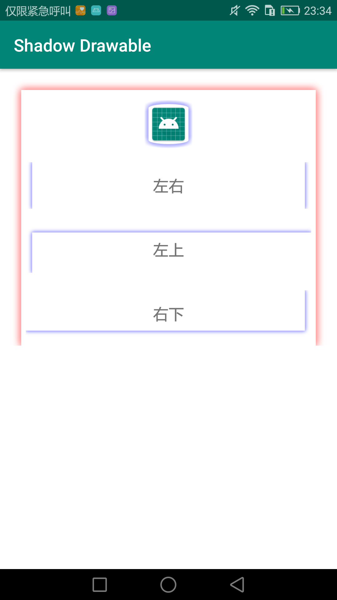

# MultiDrawable
[](https://jitpack.io/#yangsanning/MultiDrawable)
[](https://android-arsenal.com/api?level=19)

## 效果预览

| [ShadowDrawable]                      |
| ------------------------------- |
| [][ShadowDrawable]   | |


## 主要文件
| 名字             | 摘要           |
| ---------------- | -------------- |
|[ShadowDrawable]   | 阴影Drawable  |

## 添加方法

#### 1.1 添加仓库

在项目的 `build.gradle` 文件中配置仓库地址。

```android
allprojects {
	repositories {
		...
		maven { url 'https://jitpack.io' }
	}
}
```

#### 1.2 添加项目依赖

在需要添加依赖的 Module 下添加以下信息，使用方式和普通的远程仓库一样。

```android
implementation 'com.github.yangsanning:MultiDrawable:1.0.0'
```


[ShadowDrawable]:https://github.com/yangsanning/MultiDrawable/blob/master/README_ShadowDrawable.md
